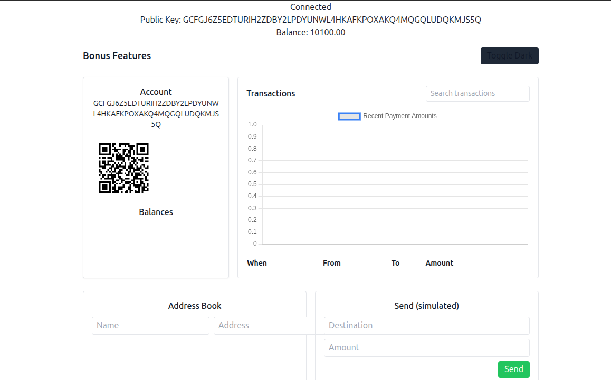

# Stellar White Belt dApp

## Project Description

Stellar White Belt dApp is a simple decentralized application built on the Stellar Testnet using React, Stellar SDK, and Freighter Wallet.

The application allows users to connect their Freighter wallet, view their XLM balance, and send XLM transactions on the Stellar Testnet. Users receive transaction feedback after each payment, including transaction status and confirmation details.

This project was built as a submission for the Stellar Level 1 – White Belt Challenge and demonstrates the fundamentals of Stellar development, including wallet integration, balance retrieval, and transaction execution.

---

## Features

- Connect Freighter Wallet
- Disconnect Wallet
- Fetch and display XLM balance
- Send XLM on Stellar Testnet
- Display transaction success/failure status
- Display transaction confirmation details
- Responsive user interface
- Error handling for failed transactions

---

## Built With

- React
- Create React App
- Stellar SDK
- Freighter Wallet API
- Stellar Testnet

---

## Installation

Clone the repository:

```bash
git clone https://github.com/Eagle-AS0/Stellar-whitebelt-dapp.git
```

Navigate to the project folder:

```bash
cd Stellar-whitebelt-dapp
```

Install dependencies:

```bash
npm install
```

Run the development server:

```bash
npm start
```

The application will be available at:

```text
http://localhost:3000
```

---

## How to Use

### Connect Wallet

1. Install Freighter Wallet.
2. Switch to Stellar Testnet.
3. Click **Connect Wallet**.
4. Approve the connection request.

### View Balance

After connecting, the application automatically fetches and displays your current XLM balance.

### Send XLM

1. Enter the recipient Stellar address.
2. Enter the amount of XLM.
3. Click **Send**.
4. Approve the transaction in Freighter Wallet.
5. View the transaction result and confirmation.

---

## Screenshots

### Wallet Connected

### Balance Displayed

### Successful Transaction

### Transaction Result


---

## Challenge Requirements Completed

### Wallet Setup

- Freighter Wallet configured
- Stellar Testnet used

### Wallet Connection

- Connect Wallet functionality implemented
- Disconnect Wallet functionality implemented

### Balance Handling

- Fetch XLM balance
- Display balance in the UI

### Transaction Flow

- Send XLM transaction on Stellar Testnet
- Success/failure feedback
- Transaction confirmation displayed

---

## Future Improvements

- Transaction history viewer
- QR code payments
- Multi-asset support
- Improved UI/UX
- Mobile optimizations

---

## Repository

GitHub Repository:

https://github.com/Eagle-AS0/Stellar-whitebelt-dapp

---

## Author

Built as a submission for the **Stellar Level 1 – White Belt Challenge**.
